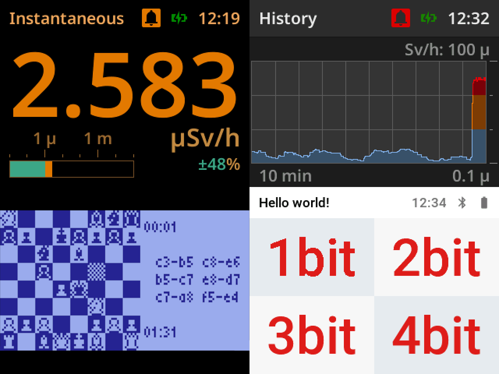

# mcu-renderer

mcu-renderer is a lightweight C graphics library designed for microcontrollers (MCUs), enabling flicker-free, anti-aliased text rendering on monochrome and color LCD displays with minimal resource usage.

## Features

- Optimized for MCUs with limited memory.
- Unified API for monochrome and color displays.
- Fast, high-quality anti-aliased font rendering.
- High font compression for efficient storage.
- Adjustable font bit-depth (1–4 bpp).
- Supports C-strings, UTF-8, and UTF-16 text encoding.
- Color displays: Requires only a small RGB565 framebuffer (covering two or more characters).
- Monochrome displays: Requires a full framebuffer.
- SDL graphics support for PC-based testing.

## Supported devices

- [SDL](docs/supported-devices.md#sdl) (for PC testing)
- [ST7789](docs/supported-devices.md#st7789) (color LCD)
- [ILI9341](docs/supported-devices.md#ili9341) (color LCD)
- [ST7565](docs/supported-devices.md#st7565) (monochrome LCD)

## Prerequisites

- C compiler (e.g., GCC) for MCU development.
- [Python](https://www.python.org) and [PIP](https://pip.pypa.io/en/stable/) for font and text processing tools.
- Hardware-specific development tools.
- SDL library for PC testing (optional).

## Quick start

1. **Include the library**: Add the device-specific header file (see [supported devices](docs/supported-devices.md)).
2. **Initialize the display**:
   ```c
   mr_t mr;
   mr_xxx_init(&mr, ...); // Replace 'xxx' with your device (e.g., mr_st7789_init)
   mr_xxx_set_sleep(&mr, false); // Disable sleep mode (color displays only)
   mr_xxx_set_display(&mr, true); // Turn on display
   ```
3. **Set up fonts**: Use provided fonts from the [fonts](fonts) folder or convert custom fonts (see [Preparing Fonts](#preparing-fonts)).
4. **Draw text**:
   ```c
   mr_set_font(&mr, &my_font);
   mr_set_fill_color(&mr, MR_COLOR_BLACK);
   mr_set_stroke_color(&mr, MR_COLOR_WHITE);
   mr_rectangle_t rectangle = { 0, 0, 64, 16 };
   mr_offset_t offset = { 0, 0 };
   mr_draw_text(&mr, "Hello, MCU!", &rectangle, &offset);
   ```
5. **Refresh screen** (monochrome or SDL):
   ```c
   mr_xxx_refresh_display(&mr);
   ```
## Setup and usage

1. **Initialize the library**:
   - Call `mr_xxx_init()` to set up the display (e.g., `mr_st7789_init()`).
   - The display starts off to prevent flickering during initial drawing.
   - Enable the display with `mr_xxx_set_display(true)`.
   - For color displays, disable sleep mode using `mr_xxx_set_sleep(false)`.

2. **Configure fonts**:
   - Use prebuilt fonts from the [fonts](fonts) folder or create custom fonts (see [Preparing Fonts](#preparing-fonts)).
   - Set the active font with `mr_set_font()` before drawing text or retrieving metrics.

3. **Define screen layout**:
   - Create non-overlapping rectangles to organize content and prevent flickering.
   - Ensure rectangle bounds stay within the display’s dimensions.

4. **Drawing operations**:
   - **Filled rectangle**:
     ```c
     mr_set_fill_color(&mr, mr_get_color(0xFF2020)); // Red (#FF2020)
     mr_draw_rectangle(&mr, &rectangle);
     ```
   - **Bitmap (monochrome)**:
     ```c
     mr_set_stroke_color(&mr, MR_COLOR_WHITE);
     mr_set_fill_color(&mr, MR_COLOR_BLACK);
     mr_draw_bitmap(&mr, &rectangle, bitmap);
     ```
   - **Image (color, RGB565)**:
     ```c
     mr_draw_image(&mr, &rectangle, image);
     ```
   - **Text**:
     ```c
     mr_set_font(&mr, &my_font);
     mr_set_fill_color(&mr, MR_COLOR_BLACK);
     mr_set_stroke_color(&mr, MR_COLOR_WHITE);
     mr_rectangle_t rectangle = { 0, 0, 64, 16 };
     mr_offset_t offset = { 0, 0 };
     mr_draw_text(&mr, "Hello", &rectangle, &offset); // C-string
     rectangle.y += 16;
     mr_draw_text_utf8(u8"こんにちは", &rectangle, &offset); // UTF-8
     ```
     - Center text horizontally using `mr_get_text_width()` (or `utf8`/`utf16` variants).
     - Center vertically using font metrics: `mr_get_cap_height()`, `mr_get_ascent()`, `mr_get_descent()`, or `mr_get_line_height()`.

5. **Refresh screen** (Monochrome or SDL):
   - Call `mr_xxx_refresh_display()` after drawing to update the display.

## Font metrics

- **Cap Height**: Height of uppercase 'A' (`mr_get_cap_height()`).
- **Ascent**: Distance from top of line to [baseline](https://en.wikipedia.org/wiki/Baseline_(typography)) (`mr_get_ascent()`).
- **Descent**: Distance from baseline to bottom of line (`mr_get_descent()`).
- **Line Height**: Total height of a text line (`mr_get_line_height()`).

**Note**: Set the font with `mr_set_font()` before retrieving metrics.

## Examples

Explore sample code in the [examples](examples) folder to see mcu-renderer in action.

## Font compression comparison

Font sizes (in bytes) for ASCII characters (0x20–0x7E):

| Font                          | Roboto 12 px | Roboto 24 px | Roboto 48 px | Roboto 72 px |
|-------------------------------|--------------|--------------|--------------|--------------|
| Adafruit_GFX/TFT_eSPI (1 bpp) | 3832         | 14589        | 56677        | 129389       |
| u8g2 (1 bpp)                  | 1508         | 3039         | 6632         | N/A          |
| mcu-renderer 1 bpp            | 1477         | 2975         | 6208         | 9663         |
| mcu-renderer 2 bpp            | 2140         | 4364         | 9191         | 14143        |
| mcu-renderer 3 bpp            | 2911         | 5973         | 12510        | 19403        |
| mcu-renderer 4 bpp            | 3723         | 7643         | 15937        | 24539        |
| MCUFont (4 bpp)               | 3125         | 6296         | 12969        | 20045        |
| TFT_eSPI (vlw)                | 7642         | 19387        | 65833        | 143333       |

## Preparing fonts

Convert fonts to mcu-renderer format using the `fontconv` tool in the [tools](tools) folder. It supports:
- Bitmap fonts: `.bdf`, `.pcf`.
- Vector fonts: `.ttf`, `.ttc`, `.otf`, `.otc`, `.woff`.

### Setup
1. Install [Python](https://www.python.org) and [PIP](https://pip.pypa.io/en/stable/).
2. Install dependencies:
   ```bash
   pip install -r tools/requirements.txt
   ```

### Usage
Run `fontconv` to convert fonts:
```bash
python tools/fontconv.py --help
```

- For vector fonts, use the `--pixels` parameter to set the number of pixels for rasterizing the [em-square](https://en.wikipedia.org/wiki/Em_(typography)). Adjust to match desired [cap height](https://en.wikipedia.org/wiki/Cap_height).
- Override cap height, ascent, or descent if the calculated values are inaccurate.

## Determining necessary characters

Use the `textproc` tool in the [tools](tools) folder to analyze text or C files and generate Unicode codepoint sets for `fontconv`.

### Setup
1. Install [Python](https://www.python.org) and [PIP](https://pip.pypa.io/en/stable/).
2. Install dependencies:
   ```bash
   pip install -r tools/requirements.txt
   ```

### Usage
Run `textproc` to process files:
```bash
python tools/textproc.py --help
```

## Additional resources

- [Roboto Font](https://fonts.google.com/specimen/Roboto): Ideal for embedded systems.
- [Material Symbols](https://fonts.google.com/icons): Symbol font for icons.
- [FontForge](https://fontforge.org/): Vector font editor.
- [Bits'N'Picas](https://github.com/kreativekorp/bitsnpicas): Bitmap font editor.
- [FontDrop!](https://fontdrop.info/): Online glyph viewer.
- [Oh my glyph](https://www.ohmyglyph.com/): Online glyph copy-paste tool.
- [Pinetools color blender](https://pinetools.com/blend-colors): Online color blending tool.
- [RGB565 color picker](https://rgbcolorpicker.com/565): Online RGB565 color selector.
