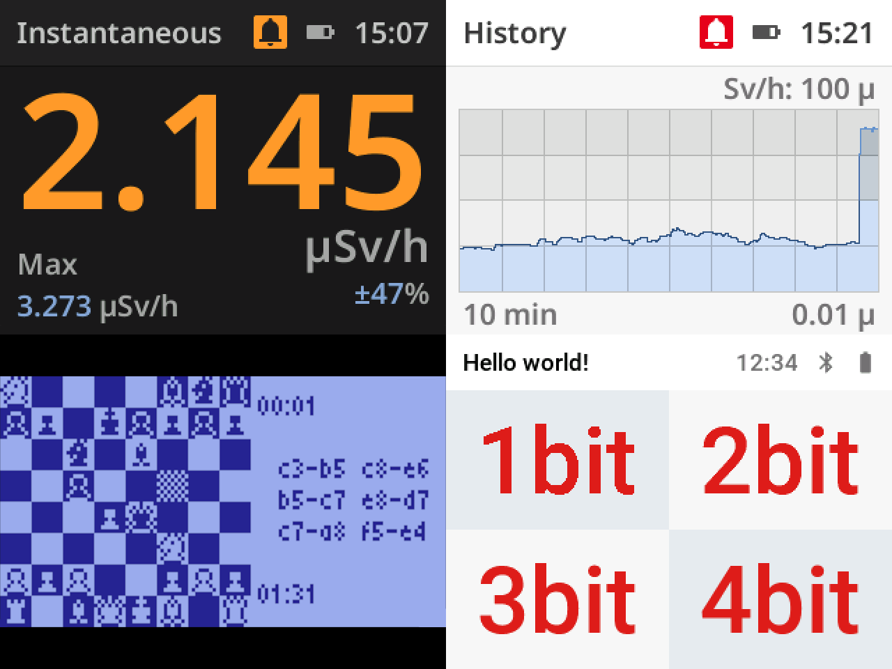

# mcu-renderer

mcu-renderer is a C-language graphics library for MCUs, focused on rendering non-flickering, anti-aliased text with low resource use on both monochrome and color LCD displays.

## Features

* Aimed at MCUs with little memory.
* Common API for monochrome and color displays.
* Very fast anti-aliased font rendering.
* High font compression ratio.
* Adjustable font bit-depth.
* C-string, UTF-8 and UTF-16 support.
* On color displays: requires only a small RGB565 framebuffer covering two or more characters.
* On monochrome displays: requires a full framebuffer.
* SDL graphics for testing on a PC.

## Supported devices

* [SDL](docs/supported-devices.md#sdl)
* [ST7789](docs/supported-devices.md#st7789)
* [ILI9341](docs/supported-devices.md#ili9341)
* [ST7565](docs/supported-devices.md#st7565)

## Setup

To start using mcu-renderer, include the [appropriate header file](docs/supported-devices.md).

In order to initialize the library, call the corresponding `mr_xxx_init()` function. The display is initially turned off, allowing you to draw before the first screen update. To turn the display on, call `mr_xxx_set_display()`. On color LCD screens, you also need to disable sleep mode with `mr_xxx_set_sleep()`.

Next, set up the fonts. You may use the fonts available in the [fonts folder](fonts), or prepare your own, as the [Preparing fonts](#preparing-fonts) section explains.

After that, set up a screen layout consisting of non-overlapping rectangles. This will avoid any flickering when updating the screen.

To draw a filled rectangle, call `mr_set_fill_color()` to set the fill color and `mr_draw_rectangle()` for the actual drawing. You can convert web colors (e.g. #ff2020) to mcu-renderer colors with the `mr_get_color` macro.

To draw a bitmap in a user-provided `uint8_t` framebuffer, call `mr_set_stroke_color()` to set the foreground color, `mr_set_fill_color()` to set the background color and `mr_draw_bitmap()` to draw the bitmap.

To draw an image in a user-provided RGB565 framebuffer, call `mr_draw_image()`.

To draw a text rectangle, call `mr_set_font()` to set the font, `mr_set_fill_color()` to set the background color, `mr_set_stroke_color()` to set the text color, and `mr_draw_text()`, `mr_draw_text_utf8()` and `mr_draw_text_utf16()` to render C-strings, UTF-8 strings and UTF-16 strings, respectively. The `offset` parameter specifies the upper left corner of the text within the drawing rectangle: to center text horizontally, use the `mr_get_text_width()`, `mr_get_text_utf8_width()` and `mr_get_text_utf16_width()` functions; to center text vertically, get the current font's metrics with `mr_get_cap_height()` (height of uppercase A), `mr_get_ascent()` (top of line to [baseline](https://en.wikipedia.org/wiki/Baseline_(typography))), `mr_get_descent()` (baseline to bottom of line) and `mr_get_line_height()` (height of line). Make sure you set the font before retrieving any metrics.

Rectangle bounds may not exceed the display size. The `offset` parameter of the text drawing functions is not limited.

Monochrome displays and SDL require a screen refresh. For refreshing the screen, call `mr_xxx_refresh_screen()` after you finished drawing.

## Examples

See the [examples](examples) folder.

## Font compression ratio comparison

(ASCII characters 0x20-0x7e)  
(sizes in bytes)

| Font                          | Roboto 12 px | Roboto 24 px | Roboto 48 px | Roboto 72 px |
|-------------------------------|--------------|--------------|--------------|--------------|
| Adafruit_GFX/TFT_eSPI (1 bpp) | 3832         | 14589        | 56677        | 129389       |
| u8g2 (1 bpp)                  | 1508         | 3039         | 6632         | N/A          |
| mcu-renderer 1 bpp            | 1473         | 2891         | 5902         | 9511         |
| mcu-renderer 2 bpp            | 2052         | 4162         | 8743         | 13969        |
| mcu-renderer 3 bpp            | 2695         | 5677         | 12128        | 18701        |
| mcu-renderer 4 bpp            | 3328         | 7329         | 15533        | 23676        |
| MCUFont (4 bpp)               | 3125         | 6296         | 12969        | 20045        |
| TFT_eSPI (vlw)                | 7642         | 19387        | 65833        | 143333       |

## Preparing fonts

In order to convert your fonts to the mcu-renderer format, use the `fontconv` tool (available in [tools](tools)), which lets you convert both `.bdf` and `.pcf` bitmap fonts as well as `.ttf`, `.ttc`, `.otf`, `.otc` and `.woff` vector fonts.

To use `fontconv`, install [Python](https://www.python.org) and [PIP](https://pip.pypa.io/en/stable/). You must also install the necessary requirements by running the following command in a terminal:

    pip install -r tools/requirements.txt

To get help about `fontconv`, run the following command in a terminal:

    python tools/fontconv.py --help

In digital typography, 72 points is usually defined as 96 pixels. For rasterizing a vector font to a given pixel size, convert the pixel size to a point size by multiplying by the factor 4/3. Not all fonts follow this rule, so you might need to tweak this factor.

`fontconv` calculates the cap height (the height of the uppercase letter A) as the difference between the ascent height (top of line to baseline) and the descent height (baseline to bottom of line). On some fonts this calculation is inaccurate, so you can override the cap height to achieve the correct result. You can also override the ascent height and the descent height.

## Determining necessary characters

To determine the necessary characters in your project, you can use the `textproc` tool (available in [tools](tools)), which lets you read text files or C-language files and produce Unicode codepoint sets.

To use `textproc`, install [Python](https://www.python.org) and [PIP](https://pip.pypa.io/en/stable/). You must also install the necessary requirements by running the following command in a terminal:

    pip install -r tools/requirements.txt

To get help about `textproc`, run the following command in a terminal:

    python tools/textproc.py --help

## Additional resources

* [Roboto font](https://fonts.google.com/specimen/Roboto): great font for embedded systems
* [Material symbols](https://fonts.google.com/icons): great symbol font
* [Font forge](https://fontforge.org/): vector font editor
* [Bits'N'Picas](https://github.com/kreativekorp/bitsnpicas): bitmap font editor
* [FontDrop!](https://fontdrop.info/): online glyph viewer
* [Oh My Glyph](https://www.ohmyglyph.com/): online glyph copy+paste
* [Pinetools blend colors](https://pinetools.com/blend-colors): Online color blender
* [RGB565 color picker](https://rgbcolorpicker.com/565): Online RGB565 color picker
